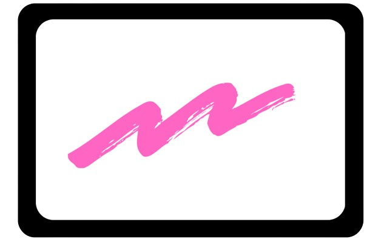

<p align="center">
  
</p>
<p align="center" size>
  
</p>
<div>
<h1 align="center" style="font-size: xxx-large">BoardSync</h1>
<p align="center" style="font-size: x-large">Where Creativity Meets Collaboration</p>
</div>
<p align="center">
  <strong>A real-time collaborative whiteboard platform for seamless teamwork and innovation.</strong>
</p>

<p align="center">
  <a href="#-features">Features</a> •
  <a href="#-demo">Live Demo</a> •
  <a href="#%EF%B8%8F-tech-stack">Tech Stack</a> •
  <a href="#-getting-started">Getting Started</a> •
  <a href="#-contributing">Contributing</a> •
  <a href="#-license">License</a>
</p>

## 🚀 Features

- **Real-time Collaborative Whiteboard**: Draw, write, and manipulate objects simultaneously with your team.
- **Integrated Group Chat**: Discuss ideas without leaving the whiteboard interface.
- **Instant Sharing**: Collaborate with anyone, anywhere, with a simple link.
- **Multiple Workspaces**: Create and manage multiple boards for different projects.
- **Cloud Saves**: Access your work from any device, anytime.
- **Open Source**: Free to use and open for community contributions.

## 🎥 Demo

[Check out our live demo here!](https://boardsync.vercel.app)


## 🛠️ Tech Stack

- [Next.js 14](https://nextjs.org/) - React framework for building user interfaces
- [TypeScript](https://www.typescriptlang.org/) - Typed superset of JavaScript
- [NextAuth.js](https://next-auth.js.org/) - Authentication for Next.js
- [MongoDB](https://www.mongodb.com/) - Document-based database
- [Socket.io](https://socket.io/) - Real-time bidirectional event-based communication
- [Redis](https://redis.io/) - For storing chats and whiteboard data in realtime

## 🏁 Getting Started

1. Clone the repository:
```
git clone https://github.com/yourusername/BoardSync.git
```
2. Install dependencies:
```
cd BoardSync
npm install
```
3. Set up environment variables:
```
cp .env.example .env.local
```
Then, fill in the necessary environment variables in `.env.local`
```

MONGODB_URI=your_mongodb_uri

NEXT_PUBLIC_CUSTOM_SERVER_URL=https://boardsync-backend.onrender.com

MAILERSEND_API_KEY=your_mailersend_api_key
MAILERSEND_EMAIL_DOMAIN=your_mailersend_email_domain

AUTH_SECRET=your_auth_secret

CLOUDINARY_CLOUD_NAME=your_cloudinary_cloud_name
CLOUDINARY_API_KEY=your_cloudinary_api_key
CLOUDINARY_API_SECRET=your_cloudinary_api_secret

GOOGLE_CLIENT_ID=your_google_client_id
GOOGLE_CLIENT_SECRET=your_google_client_secret

GITHUB_CLIENT_ID=your_github_client_id
GITHUB_CLIENT_SECRET=your_github_client_secret
```
Replace the placeholder values with your actual credentials and settings.

4. Run the development server:
```
npm run dev
```

5. Open [http://localhost:3000](http://localhost:3000) in your browser to see the result.

## 🤝 Contributing

We welcome contributions from the community! If you'd like to contribute, please:

1. Fork the repository
2. Create your feature branch (`git checkout -b feature/Your_Feature_Name`)
3. Commit your changes (`git commit -m 'Add some Your_Feature_Name'`)
4. Push to the branch (`git push origin feature/Your_Feature_Name`)
5. Open a Pull Request

## 📜 License

This project is open source and available under the [MIT License](LICENSE).

---

<p align="center">
Made with ❤️ by <a href="https://www.linkedin.com/in/soham-haldar/">Soham Haldar</a>
</p>
